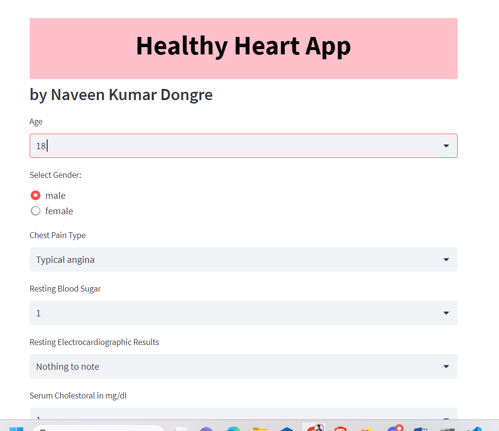

# Heart Disease Prediction App

This project is an application for predicting heart disease using Artificial Neural Networks (ANN). It is built with Streamlit for the user interface and hosted on the Streamlit platform.

## Project Overview

- Predicted heart disease using various machine learning algorithms:
  - Logistic Regression (LR)
  - Naive Bayes (NB)
  - Support Vector Machine (SVM)
  - k-Nearest Neighbors (KNN)
  - Artificial Neural Network (ANN)
  - Convolutional Neural Network (CNN)

- Achieved impressive testing accuracy:
  - ANN-based model: Approximately 98.54%
  - Second-best model: CNN with an accuracy of 96.58%

- Utilized Boruta feature selection technique:
  - Reduced features from 13 to 10, a 15.38% reduction.
  - Maintained ANN model accuracy at 98.54%.

- Notable result:
  - Without feature selection, using the entire dataset, the ANN model achieved a similar test accuracy of around 98.56%.

## Dataset

The dataset used for this project can be found on Kaggle at the following link:
[Heart Disease Dataset](https://www.kaggle.com/datasets/johnsmith88/heart-disease-dataset)

## Jupyter Notebook

- For a detailed analysis of the dataset and code used in this project, refer to the [Jupyter Notebook](./main_final(with_all_metrics)_real.ipynb).

## Live Project

You can access the live project by following this link:
[Heart Disease Prediction App](https://naveenkumardongre-heart-disease-prediction-app-c1px5m.streamlit.app/)

## Instructions for Running the App Locally

1. Clone this repository to your local machine.
2. Install the required libraries using `pip install -r requirements.txt`.
3. Run the Streamlit app using the command `streamlit run app.py`.

Enjoy predicting heart disease with our app!
